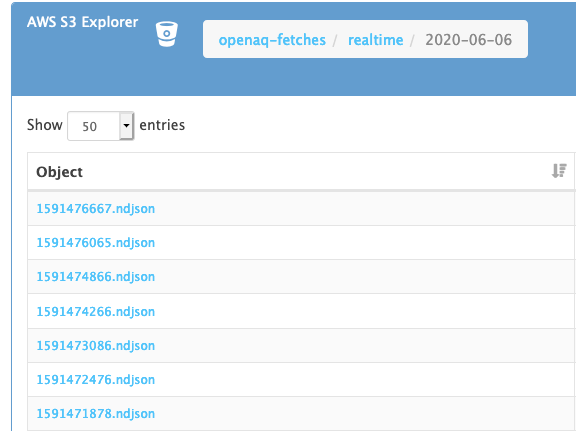
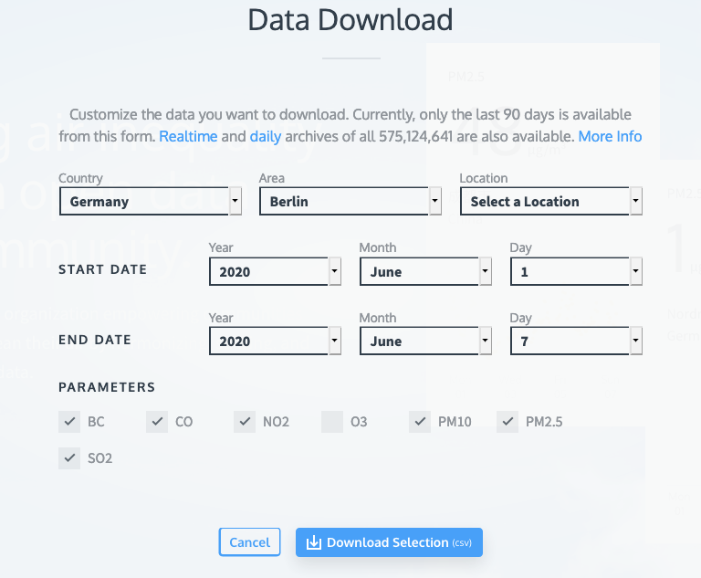

# OpenAQ Toolkit <!-- omit in toc -->

Collection of user guides, tools, and links to resources for working with OpenAQ data.

- [Resources](#resources)
	- [User Guides](#user-guides)
	- [Tools](#tools)
	- [Links](#links)
- [Download OpenAQ archive data from S3 using `awscli`](#download-openaq-archive-data-from-s3-using-awscli)
- [How big is the OpenAQ S3 bucket?](#how-big-is-the-openaq-s3-bucket)
- [Convert ndjson to InfluxDB line protocol format](#convert-ndjson-to-influxdb-line-protocol-format)
- [Convert CSV to InfluxDB line protocol format](#convert-csv-to-influxdb-line-protocol-format)
- [Contributing](#contributing)

## Resources

### User Guides

- [Access OpenAQ data via a filterable SNS topic](https://medium.com/@openaq/get-faster-access-to-real-time-air-quality-data-from-around-the-world-c6f9793d5242)
- [Using Athena to access the whole archive](https://medium.com/@openaq/how-in-the-world-do-you-access-air-quality-data-older-than-90-days-on-the-openaq-platform-8562df519ecd)
- [Air Quality Collection with TimescaleDB - Sample Application](https://github.com/timescale/examples/tree/master/air-quality)

### Tools

- [openaq.org](https://openaq.org) - The main OpenAQ website, contains CSV download pages and the world pollutant map.
- [ropensci/ropenaq](https://github.com/ropensci/ropenaq) - R package for the OpenAQ API
- [nickolasclarke/openaq](https://github.com/nickolasclarke/openaq) - JavaScript client for the OpenAQ API
- [dhhagan/py-openaq](https://github.com/dhhagan/py-openaq) - Python wrapper for the OpenAQ API
- [openaq-postman](https://github.com/dolugen/openaq-postman) - Postman collections for working with OpenAQ API
- [jackkoppa/cityaq](https://github.com/jackkoppa/cityaq) - Compare air quality for cities
- [dolugen/openaq-browser](https://github.com/dolugen/openaq-browser) - A web client for OpenAQ API
- [barronh/scrapenaq](https://github.com/barronh/scrapenaq) - Download and convert OpenAQ archived data with Pandas
- [dolugen/openaq-swagger](https://github.com/dolugen/openaq-swagger) - OpenAPI v3 spec of OpenAQ API
- [dolugen/sns-s3-influxdb](https://github.com/dolugen/sns-s3-influxdb) - Populate InfluxDB with air quality data

### Links

- [OpenAQ on AWS](https://registry.opendata.aws/openaq/) - OpenAQ's publically available S3 bucket and SNS topic informations.

## Download OpenAQ archive data from S3 using `awscli`



OpenAQ stores metric data in a S3 bucket, and [it's publicly available](https://openaq-fetches.s3.amazonaws.com/index.html). One way to download from the archive is using the `aws s3` command.

**Prerequisites**: You need a free AWS account, and have [`awscli`](https://pypi.org/project/awscli/) installed and configured.

Download a single file:
```shell
aws s3 cp s3://openaq-fetches/realtime-gzipped/2020-06-06/1591476667.ndjson .
```

Download files for 1 day:
```shell
aws s3 cp s3://openaq-fetches/realtime-gzipped/2020-06-06/ . --recursive
```

You can go up 1 level and download the entire archive if you wish.

If you prefer to not use `awscli`, take a look at this tool that uses the scraping approach: [barronh/scrapenaq](https://github.com/barronh/scrapenaq).

## How big is the OpenAQ S3 bucket?

```shell
aws s3 ls --summarize --human-readable --recursive s3://openaq-fetches
```

As of June 2020, it's **323 GB**.

## Convert ndjson to InfluxDB line protocol format

The archive files in the S3 bucket are `ndjson` formatted, or *newline delimited JSON*. Meaning it's just JSON, but each line is a separate JSON object.

If you were to convert this to InfluxDB's line protocol, you can use `ndjson2lineprotocol.py` script that's found in this repo.

```shell
cat *.ndjson | ./ndjson2lineprotocol.py
```

The script outputs to standard output, so you may want to redirect it to a file.

## Convert CSV to InfluxDB line protocol format

Addition to the S3 option, you can filter and download data as CSV from [openaq.org](https://openaq.org/#/countries) website.



After downloading the CSV, feed the file to `csv2lineprotocol.py` like so:

```shell
cat openaq.csv | ./csv2lineprotocol.py
```

## Contributing

Something missing or need fixing here? Please [use the issues page](https://github.com/dolugen/openaq-toolkit/issues) to submit requests and ask questions. You can also create a [Pull Request](https://help.github.com/en/github/collaborating-with-issues-and-pull-requests/creating-a-pull-request) with your changes.
